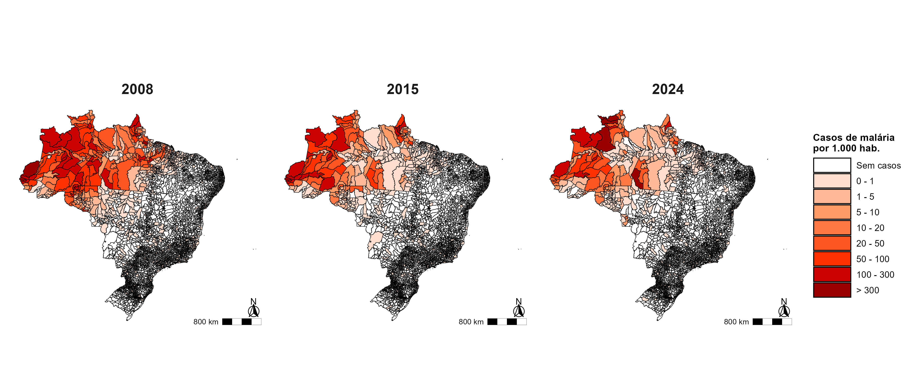

# 🦟 Distribuição da Incidência de Malária no Brasil

## 🎯 Objetivo

Este projeto é uma iniciativa para disseminar o uso de dados públicos e análise de dados em R, voltada especialmente para iniciantes. Como exemplo prático, são utilizados dados sobre a incidência de malária no Brasil nos anos de 2008, 2015 e 2024.

---

## 🧬 Sobre a Malária

A malária é uma doença infectocontagiosa, causada por parasitas do gênero Plasmodium e transmitida por mosquitos do gênero Anopheles.

🔎 Apesar dos avanços no diagnóstico e tratamento, a malária ainda é considerada um importante problema de saúde pública em países de clima tropical, devido às condições favoráveis à proliferação do mosquito transmissor e aos desafios na manutenção de políticas de controle eficazes.

- 🧪 **Desafio científico**: o mosquito vetor adapta-se facilmente aos medicamentos utilizados.
- 🌎 **Desafio geográfico**: alta incidência em regiões tropicais, onde o clima favorece a proliferação do vetor e a população frequentemente enfrenta condições de vulnerabilidade socioeconômica.
- 🏛 **Desafio político**: políticas de combate muitas vezes são descontinuadas, favorecendo a reincidência cíclica.

---

## 📊 Fontes de Dados

- 🩺 **Casos de Malária**: [Ministério da Saúde - Tableau Público](https://public.tableau.com/app/profile/mal.ria.brasil/viz/Dadosparacidado_201925_03_2020/Ttulo)
- 👥 **População**: [Estimativas Populacionais - IBGE/SIDRA](https://sidra.ibge.gov.br/pesquisa/estimapop/tabelas)

---
📐 Cálculo da Taxa de Incidência

Para comparar a situação epidemiológica entre municípios de diferentes tamanhos populacionais, foi calculada a taxa de incidência de malária, expressa como o número de casos por 1.000 habitantes.
O uso da taxa permite uma comparação proporcional entre municípios, independentemente da população total. Dessa forma, evita-se distorções que ocorreriam ao comparar apenas o número absoluto de casos.
A fórmula utilizada foi:


Esse indicador padronizado facilita a identificação de áreas com maior risco de transmissão e permite análises comparáveis entre diferentes regiões e anos.

---
## 📦 Pacotes Utilizados

```r
library(tidyverse)
library(sf)
library(geobr)
library(ggspatial)
library(readxl)
```

---

## 🔄 Fluxo de Trabalho

- **Importação dos dados epidemiológicos (malária) e demográficos (população).**  
- **Tratamento, junção e cálculo da taxa de incidência (casos por 1.000 habitantes).**  
- **Integração com dados espaciais oficiais (geobr).**
- **Categorização de taxas.**
- **Geração de mapas para os anos analisados.**
- **Exportação em alta resolução.**
- 
---

## ✨ Visualização Final

A Figura gerada é um painel de mapas como o exemplo abaixo:



---

## 🔎 Interpretação dos Resultados

🗺 Os resultados indicam uma redução na incidência de malária no Brasil entre 2008 e 2024. No entanto, a malária permanece concentrada em municípios da região Amazônica, exigindo ações contínuas de controle, vigilância epidemiológica e investimentos estruturantes em saúde pública.

---

## ✍️ Autoria

Projeto por **Valéria Andrade Silva**  
Doutoranda em Economia – Cedeplar/UFMG  
💡 [LinkedIn](www.linkedin.com/in/valéria-andrade-silva)  
📧 valeria.andrade81@hotmail.com
